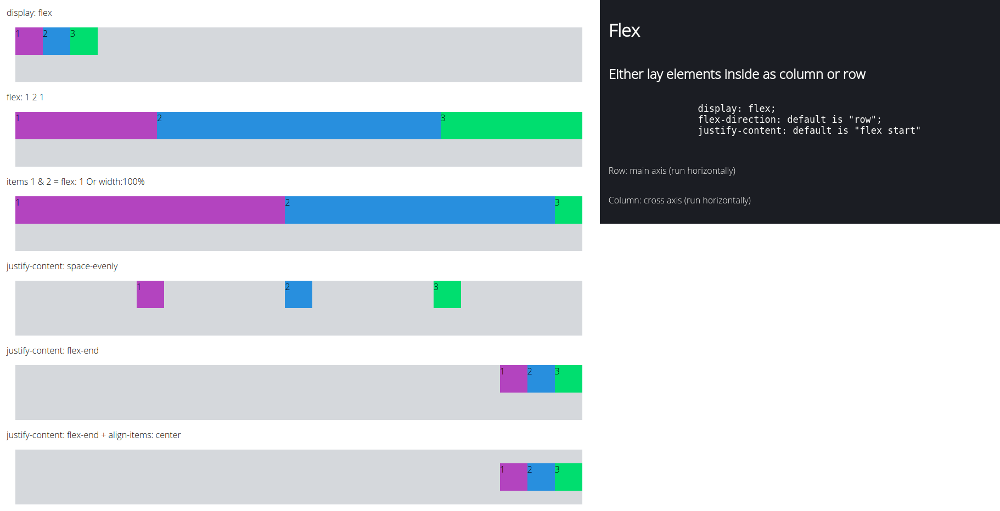
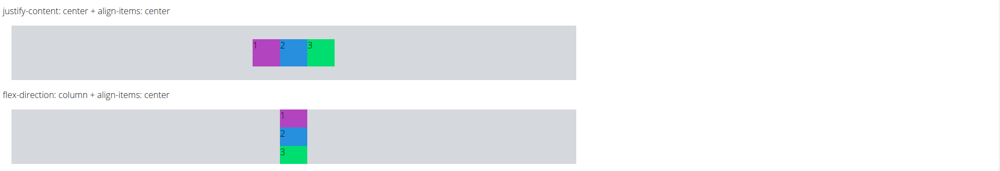

## More tutorial
flex properties:
    https://css-tricks.com/almanac/properties/f/flex/

## Output







## flex.css
```css
:root {
    font-family: 'Open Sans';
    font-size: 1em;
    --note-bg: #1b1e23;
    --note-txt: #fbfbf8;

}

body {
    margin: 0;
    padding: 0;
    background-color: #fff;
    color: #000;
}

.flex-container {
    background: #D5D8DC;
    display: flex;
    flex-direction: row;
    /* width: 100%; */
    height: 100px;
    margin: 1rem;
}

.flex-main {
    padding: 1rem;
    margin-right: 40vw;
}

.flex-element {
    /* flex: 1; */
    width: 50px;
    height: 50px;

}

/* color */
.flex-element:nth-child(1) {
    background-color: #A569BD;   
}

.flex-element:nth-child(2) {
    background-color: #3498DB;
}

.flex-element:nth-child(3) {
    background-color: #2ECC71;
}

/* space evenly */
.flex-container:nth-child(4) {
    justify-content: space-evenly;
}

/* flex-end */
.flex-container:nth-child(5) {
    justify-content: flex-end;
}

/* flex-end + align-item */
.flex-container:nth-child(6) {
    justify-content: flex-end;
    align-items: center;
}

/* center + align-item */
.flex-container:nth-child(7) {
    justify-content: center;
    align-items: center;
}

/* center + align-item */
.flex-container:nth-child(8) {
    flex-direction: column;
    align-items: center;
}
```

## note.css
```css
.note-main {
    position: fixed;
    right: 0;
    width: 40vw;
}

.note {
    background-color: var(--note-bg);
    color: var(--note-txt);
    display: flex;
    flex-direction: column;
    padding: 1rem;

}

.note p {
    font-weight: 2em;
}

.note pre {
    font-size: 1.3em;
}
```

```html
<!DOCTYPE html>
<html lang="en">
<head>
    <meta charset="UTF-8">
    <meta name="viewport" content="width=device-width, initial-scale=1.0">
    <link rel="stylesheet" href="flex.css">
    <link rel="stylesheet" href="note.css">
    <link href="https://fonts.googleapis.com/css2?family=Open+Sans:wght@300&display=swap" rel="stylesheet">
    <title>Document</title>
</head>
<body>
    <div class="note-main">
        <div class="note">    
            <h1>Flex</h1>
            <h2>Either lay elements inside as column or row</h2>
            <pre>
                display: flex;
                flex-direction: default is "row";
                justify-content: default is "flex start"
            </pre>
            <p>Row: main axis (run horizontally)</p>
            <p>Column: cross axis (run horizontally)</p>
        </div>
    </div>
    
    <div class="flex-main">
        display: flex
        <div class="flex-container">
            <div class="flex-element">1</div>
            <div class="flex-element">2</div>
            <div class="flex-element">3</div>
        </div>
        flex: 1 2 1
        <div class="flex-container">
            <div class="flex-element" style="flex: 1">1</div>
            <div class="flex-element" style="flex: 2">2</div>
            <div class="flex-element" style="flex: 1">3</div>
        </div>
        items 1 & 2 = flex: 1 Or width:100%
        <div class="flex-container">
            <div class="flex-element" style="flex: 1;">1</div>
            <div class="flex-element" style="flex: 1">2</div>
            <div class="flex-element">3</div>
        </div>
        justify-content: space-evenly
        <div class="flex-container">
            <div class="flex-element">1</div>
            <div class="flex-element">2</div>
            <div class="flex-element">3</div>
        </div>
        justify-content: flex-end
        <div class="flex-container">
            <div class="flex-element">1</div>
            <div class="flex-element">2</div>
            <div class="flex-element">3</div>
        </div>
        justify-content: flex-end
        + align-items: center
        <div class="flex-container">
            <div class="flex-element">1</div>
            <div class="flex-element">2</div>
            <div class="flex-element">3</div>
        </div>
        justify-content: center
        + align-items: center
        <div class="flex-container">
            <div class="flex-element">1</div>
            <div class="flex-element">2</div>
            <div class="flex-element">3</div>
        </div>
        flex-direction: column + align-items: center
        <div class="flex-container">
            <div class="flex-element">1</div>
            <div class="flex-element">2</div>
            <div class="flex-element">3</div>
        </div>

    </div>
</body>
</html>

```

