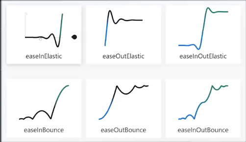
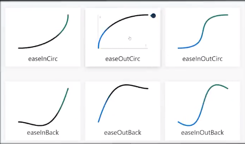

## CSS Animation
Changes from 1 css style to another
* Every animation has atleast 2 states: 
    1. a starting point
    2. an ending point
Tween animation: calculate all the values(time) in between.
> The browser calculates the new value(ex: opacity) from every frame rendered, using linear time function CSS/time 

* If you don't want the css to animate in a linear time:
    * Built-in easing function 
        
        
    * Custome Bezier curve
        
### Using transition
    1. Property you want to animate (animate fade-in fade-out will use opacity)
    2. Duration (s, ms...). When the opacity of the element changes, the opacity per frame will be handled by css
        * For this to work, we can use sudo-selector (:hover...) then change the property
    3. Delay/Timing function. Ex: 
        * ease-in-out 
        * cubic-bezier(0.1, 0.7, 1.0. 0.1) // custom bezier curver
    

### Animation independent of selector: keyframes
    * We can define the animation in these steps
        1. from
        2. percentage
        3. to
    * Then in the selector, use animation: then pass keyframe as property
    > The from has like easing function but the to just suddenly being switch to.

#### animation-iteration-count
    * infinite: loop forever