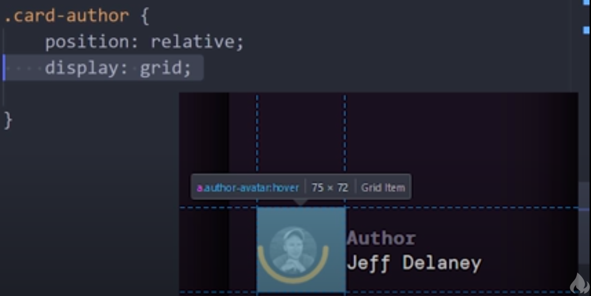

## Cards stacked horizontally
- Position:
    - Combine `grid` & `flexbox` layout
- Depth:
    - `Transform` & `shadows`
- Animation:
    - `Transition`

- Others
    - Gradient text background
    - SVG style : semi-circle under avatar

### CSS lessons
- Notion:

### Tools
1. How does he make the grid values in the web show in the editor like that?
    - 
    > Or he is just edit the video like that.

- Reference: 
    1. [Fireship](https://youtu.be/29deL9MFfWc)
    - Open the application : [Only available locally](//home/makra/Desktop/Files/01_Programming/10_Design/01_Css/07_cssCards/public/index.html)

